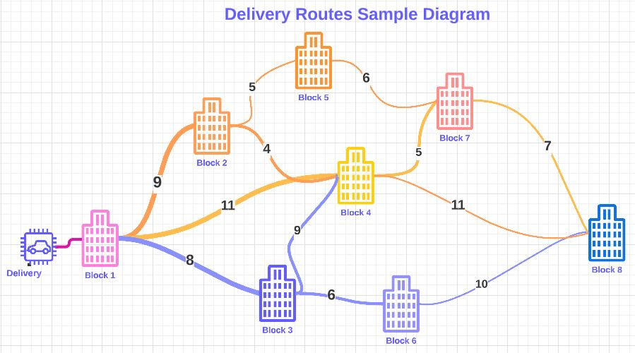
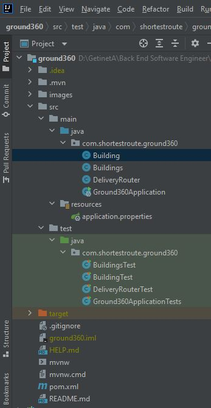

<h1 align="center"> 360Ground </h1>

# Contents

- [Given problem](https://github.com/gama1221/ground360#Given)
- [My Solution](https://github.com/gama1221/ground360#Solution)
  - [Diagram](https://github.com/gama1221/ground360#Diagram)
  - [Project Structure](https://github.com/gama1221/ground360#Structure)
  - [Building helper class](https://github.com/gama1221/ground360#Building)
  - [Buildings helper class](https://github.com/gama1221/ground360#Buildings)
  - [DeliveryRouter class](https://github.com/gama1221/ground360#DeliveryRouter)
  - [Ground360Application Main class](https://github.com/gama1221/ground360#Ground360Application)
  - [Test classes using JUnit 5](https://github.com/gama1221/ground360#Test)
    - [Test Building helper class using JUnit 5](https://github.com/gama1221/ground360#TestBuilding)
    - [Test Buildings helper class using JUnit 5](https://github.com/gama1221/ground360#TestBuildings)
    - [Test DeliveryRouter class using JUnit 5](https://github.com/gama1221/ground360#TestDeliveryRouter)
- [Author (Made in...)](https://github.com/gama1221/ground360#Author)

<p align="center">
  
  
</p>

# Given
<h2 align="center">
  Code Challange
</h2>

### Implement a route planning algorithm for a delivery company.
A delivery company has to deliver packages to several buildings in a city. Given the set of buildings and the distance between every pair of buildings, the problem is to find the shortest possible route that visits every building exactly once and returns to the starting building.

Implement a function that takes a list of buildings and a starting building and returns the shortest possible route to travel from the starting building to all the other buildings, visiting all the buildings exactly once and returning to the starting building.
```python
Given Definition(Function) using python
def delivery_route_optimization(buildings: List[Building], start: Building) -> List[Building]:
```

```java
Mine implementation using java 
public static computesShortestPossibleRoutesToTravelFromSourceBuildings(Buildings buildings, Building sourceBuilding){
  // Write or include the logic here
}
```

where:<br/>
* <b>buildings</b> is a list of buildings with the name and distance attributes.<br/>
* <b>start</b> is the starting building.<br/>

The function should return a list of buildings representing the optimized delivery route, starting and ending with the start building.

<b>Note:</b> Assume that the distance between any two buildings is given and it is symmetrical (i.e., if there is a path from building A to building B with a distance of d, then there is a path from building B to building A with a distance of d).

<h3> Submission Instructions </h3>

1. <b>Code:</b> you can write your solution in a preferred programming language and provide the full code.
2. <b>Comments:</b> The code should be well-commented and should explain the thought process and logic behind the solution.
3. <b>Test Cases:</b> provide test cases that demonstrate the correctness of their solution, including edge cases.
4. <b>Time & Space Complexity Analysis:</b> provide an analysis of the time and space complexity of their solution.
5. <b>Document:</b> Provide a document explaining the solution, how you approached the problem, and how you tested it.
6. <b>Submission:</b> You can upload the code to a code hosting platform (e.g., GitHub, GitLab, Bitbucket) and share the link.

<h3>
  Plagiarism
</h3>

It is important to note that plagiarism will not be tolerated. All submitted solutions must be original and written by you, who applied for the vacancy and submitted the solution. Any evidence of plagiarism will be thoroughly investigated and may result in disqualification from the assessment process.
# Solution
Breaking the problem into connected pieces as follows
  1. Buildings class
  2. Building class
  3. Delivery Route Optimization class
  4. Sample examples with sample inputs
  5. Test classes
  
# Diagram
<p align="center">
  
</p>

# Structure

<p align="center"> Mere is the Project structure using Intellij IDE </p>

<p align="center">
  
</p>

# Building
```java
package com.shortestroute.ground360;

import java.util.HashMap;
import java.util.LinkedList;
import java.util.Map;

public class Building {
    /**
     * Building properties
     * Setter and Getter methods
     * Used to access private fields by other classes
     */
    private String name;
    private LinkedList<Building> shortestPath = new LinkedList<>();
    private Integer distance = Integer.MAX_VALUE;// considers as infinity value except to the starting building
    private Map<Building, Integer> adjacentBuilding = new HashMap<>();

    /**
     * A constructor for creating Building object
     * @param name - the param used to create Building object via name parameter
     */
    public Building(String name){
        this.name = name;
    }
    /**
     * Attach and map the building with distance
     */
    public void addDestination(Building destination, int distance){
        adjacentBuilding.put(destination, distance);
    }
    public String getName() {
        return name;
    }
    public void setName(String name) {
        this.name = name;
    }
    public LinkedList<Building> getShortestPath() {
        return shortestPath;
    }
    public void setShortestPath(LinkedList<Building> shortestPath) {
        this.shortestPath = shortestPath;
    }
    public Integer getDistance() {
        return distance;
    }
    public void setDistance(Integer distance) {
        this.distance = distance;
    }
    public Map<Building, Integer> getAdjacentBuilding() {
        return adjacentBuilding;
    }
    public void setAdjacentBuilding(Map<Building, Integer> adjacentBuilding) {
        this.adjacentBuilding = adjacentBuilding;
    }
}
```

# Buildings
```java
package com.shortestroute.ground360;

import java.util.HashSet;
import java.util.Set;

public class Buildings {
    /**
     * Contains Building properties as well as add building method to buildingSet collection object
     * Buildings are the collection of building i.e. one or more building can make Buildings properties
     * Setter and Getter methods
     * Used to access private fields by other classes
     */
    private Set<Building> buildingSet = new HashSet<>();

    /**
     * Add a building to set of buildings object
     * @param building - an individual building to be added to set of buildings
     */
    public void addBuilding(Building building){
        buildingSet.add(building);
    }

    public Set<Building> getBuildingSet() {
        return buildingSet;
    }

    public void setBuildingSet(Set<Building> buildingSet) {
        this.buildingSet = buildingSet;
    }
}
```
# DeliveryRouter
```java
package com.shortestroute.ground360;

import java.util.*;
import java.util.stream.Collectors;

public class DeliveryRouter {
    /**
     * It computes the all shortest possible routes to travel from the source building
     * @param buildings - List of buildings to go for delivery
     * @param sourceBuilding - The delivery person starts building
     * @return - It returns all possible shortest routes to travel from source to all buildings
     */
    public static Buildings computesShortestPossibleRoutesToTravelFromSourceBuilding(Buildings buildings,
                                                                                     Building sourceBuilding){
        sourceBuilding.setDistance(0);
        Set<Building> shortestPossiblePathBuildings = new HashSet<>();
        Set<Building> allOtherBuildings = new HashSet<>();
        allOtherBuildings.add(sourceBuilding);

        while (allOtherBuildings.size() != 0) {
            Building currentBuilding = getShortestDistanceBuilding(allOtherBuildings);
            allOtherBuildings.remove(currentBuilding);
            for (Map.Entry<Building, Integer> adjacencyPair : currentBuilding.getAdjacentBuilding().entrySet()) {
                Building adjacentNode = adjacencyPair.getKey();
                Integer edgeWeigh = adjacencyPair.getValue();
                if (!shortestPossiblePathBuildings.contains(adjacentNode)) {
                    computesShortestDistance(adjacentNode, edgeWeigh, currentBuilding);
                    allOtherBuildings.add(adjacentNode);
                }
            }
            shortestPossiblePathBuildings.add(currentBuilding);
        }
        return buildings;
    }
    /**
     * It calculates or computes the shortest distance
     * @param computeBuilding - The building to be evaluated or computed
     * @param betweenWeigh - The distance between each Building
     * @param sourceBuilding - The Source building
     */
    private static void computesShortestDistance(Building computeBuilding,
                                                 Integer betweenWeigh,
                                                 Building sourceBuilding) {
        Integer sourceDistance = sourceBuilding.getDistance();
        if (sourceDistance + betweenWeigh < computeBuilding.getDistance()) {
            computeBuilding.setDistance(sourceDistance + betweenWeigh);
            LinkedList<Building> shortestPath = new LinkedList<>(sourceBuilding.getShortestPath());
            shortestPath.add(sourceBuilding);
            computeBuilding.setShortestPath(shortestPath);
        }
    }
    /**
     *  Which computes the shortest distance building
     * @param allBuildings - takes set of buildings
     * @return - the shortest distance building object
     */
    private static Building getShortestDistanceBuilding(Set<Building> allBuildings) {
        Building shortestDistanceBuilding = null;
        int shortestDistance = Integer.MAX_VALUE;
        for (Building building : allBuildings) {
            int buildingDistance = building.getDistance();
            if (buildingDistance < shortestDistance) {
                shortestDistance = buildingDistance;
                shortestDistanceBuilding = building;
            }
        }
        return shortestDistanceBuilding;
    }
    public static void deliveryRouteOptimizationDemo(){
        
      Building block1 = new Building("Building 1");
      Building block2 = new Building("Building 2");
      Building block3 = new Building("Building 3");
      Building block4 = new Building("Building 4");
      Building block5 = new Building("Building 5");
      Building block6 = new Building("Building 6");

      block1.addDestination(block2, 11);
      block1.addDestination(block3, 16);
      
      block2.addDestination(block4, 13);
      block2.addDestination(block5, 16);
      
      block3.addDestination(block6, 11);
      
      block6.addDestination(block4, 3);
      block6.addDestination(block5, 6);
      
      block5.addDestination(block6, 6);
      
      block1.addDestination(block2, 11);
      block1.addDestination(block3, 16);
      
      block2.addDestination(block4, 13);
      block2.addDestination(block5, 16);
      
      block3.addDestination(block6, 11);
      
      block4.addDestination(block5, 2);
      block4.addDestination(block6, 3);
      
      block6.addDestination(block6, 6);

      Buildings buildings = new Buildings();

      buildings.addBuilding(block1);
      buildings.addBuilding(block2);
      buildings.addBuilding(block3);
      buildings.addBuilding(block4);
      buildings.addBuilding(block5);
      buildings.addBuilding(block6);

        DeliveryRouter.computesShortestPossibleRoutesToTravelFromSourceBuilding(graph, block12)
                .getBuildingSet().forEach(building -> {
                    String path = building.getShortestPath().stream()
                            .map(Building::getName).map(Objects::toString)
                            .collect(Collectors.joining(" => "));
                    System.out.println((path.isBlank()
                            ? "%s : %s".formatted(building.getName(), building.getDistance())
                            : "%s => %s : %s".formatted(path, building.getName(), building.getDistance()))
                    );
                });
    }
}
```
# Ground360Application
```java
package com.shortestroute.ground360;

import org.springframework.boot.SpringApplication;
import org.springframework.boot.autoconfigure.SpringBootApplication;

@SpringBootApplication
public class Ground360Application {
    public static void main(String[] args) {
        SpringApplication.run(Ground360Application.class, args);
        DeliveryRouter.deliveryRouteOptimizationDemo();
    }
}
```
# Test
Test the main method to solve the problem as well as the helper classes using JUnit 5 liberary
## TestBuilding
```java
package com.shortestroute.ground360;

import static org.junit.jupiter.api.Assertions.assertEquals;
import static org.junit.jupiter.api.Assertions.assertSame;

import java.util.HashMap;
import java.util.LinkedList;
import java.util.Map;

import org.junit.jupiter.api.Test;
import org.springframework.boot.test.context.SpringBootTest;

@SpringBootTest
class BuildingTest {
    @Test
    void contextLoads() {
    }

    /**
     * Methods under test:
     *
     * <ul>
     *   <li>{@link Building#Building(String)}
     *   <li>{@link Building#setAdjacentBuilding(Map)}
     *   <li>{@link Building#setDistance(Integer)}
     *   <li>{@link Building#setName(String)}
     *   <li>{@link Building#setShortestPath(LinkedList)}
     *   <li>{@link Building#getAdjacentBuilding()}
     *   <li>{@link Building#getDistance()}
     *   <li>{@link Building#getName()}
     *   <li>{@link Building#getShortestPath()}
     * </ul>
     */
    @Test
    void testConstructor() {
        Building actualBuilding = new Building("Name");
        HashMap<Building, Integer> buildingIntegerMap = new HashMap<>();
        actualBuilding.setAdjacentBuilding(buildingIntegerMap);
        actualBuilding.setDistance(1);
        actualBuilding.setName("Name");
        LinkedList<Building> buildingList = new LinkedList<>();
        actualBuilding.setShortestPath(buildingList);
        assertSame(buildingIntegerMap, actualBuilding.getAdjacentBuilding());
        assertEquals(1, actualBuilding.getDistance().intValue());
        assertEquals("Name", actualBuilding.getName());
        assertSame(buildingList, actualBuilding.getShortestPath());
    }

    /**
     * Method under test: {@link Building#addDestination(Building, int)}
     */
    @Test
    void testAddDestination() {
        Building building = new Building("Name");
        building.addDestination(new Building("Name"), 2);
        assertEquals(1, building.getAdjacentBuilding().size());
    }
}
```
## TestBuildings
Test Buildings java classes as follows
```java
package com.shortestroute.ground360;

import static org.junit.jupiter.api.Assertions.assertEquals;
import static org.junit.jupiter.api.Assertions.assertSame;

import java.util.HashSet;
import java.util.Set;

import org.junit.jupiter.api.Test;

class BuildingsTest {
    /**
     * Method under test: {@link Buildings#addBuilding(Building)}
     */
    @Test
    void testAddBuilding() {
        Buildings buildings = new Buildings();
        buildings.addBuilding(new Building("Name"));
        assertEquals(1, buildings.getBuildingSet().size());
    }

    /**
     * Methods under test:
     *
     * <ul>
     *   <li>default or parameterless constructor of {@link Buildings}
     *   <li>{@link Buildings#setBuildingSet(Set)}
     *   <li>{@link Buildings#getBuildingSet()}
     * </ul>
     */
    @Test
    void testConstructor() {
        Buildings actualBuildings = new Buildings();
        HashSet<Building> buildingSet = new HashSet<>();
        actualBuildings.setBuildingSet(buildingSet);
        assertSame(buildingSet, actualBuildings.getBuildingSet());
    }
}
```
## TestDeliveryRouter
Test the actual method which is the delivery router optimizer
```java
package com.shortestroute.ground360;

import org.junit.jupiter.api.Test;

import static org.junit.jupiter.api.Assertions.assertEquals;

class DeliveryRouterTest {
    /**
     * Method under test: {@link DeliveryRouter#computesShortestPossibleRoutesToTravelFromSourceBuilding(Buildings, Building)}
     */
    @Test
    void testComputesShortestPossibleRoutesToTravelFromSourceBuilding() {
        Buildings buildings = new Buildings();
        Building building = new Building("Name");
        DeliveryRouter.computesShortestPossibleRoutesToTravelFromSourceBuilding(buildings, building);
        assertEquals(0, building.getDistance().intValue());
    }
    /**
     * Method under test: {@link DeliveryRouter#computesShortestPossibleRoutesToTravelFromSourceBuilding(Buildings, Building)}
     */
    @Test
    void testComputesShortestPossibleRoutesToTravelFromSourceBuilding3() {
        Buildings buildings = new Buildings();

        Building building = new Building("Name");
        building.addDestination(new Building("Name"), 2);
        DeliveryRouter.computesShortestPossibleRoutesToTravelFromSourceBuilding(buildings, building);
        assertEquals(0, building.getDistance().intValue());
    }

    /**
     * Method under test: {@link DeliveryRouter#computesShortestPossibleRoutesToTravelFromSourceBuilding(Buildings, Building)}
     */
    @Test
    void testComputesShortestPossibleRoutesToTravelFromSourceBuilding4() {
        Buildings buildings = new Buildings();

        Building building = new Building("Name");
        building.addDestination(new Building("Name"), 2);
        building.addDestination(new Building("Name"), 2);
        DeliveryRouter.computesShortestPossibleRoutesToTravelFromSourceBuilding(buildings, building);
        assertEquals(0, building.getDistance().intValue());
    }
}
```
# Author
* **Github** <[Getinet Amare](https://github.com/gama1221)>
* **Email** <[Getinet Amare](mailto:getinetamare@gmail.com)>
* **WhatsApp** <[Getinet Amare](https://wa.me/+251991732949)>
* **LinkedIn** <[Getinet Amare](https://www.linkedin.com/in/getinet-mekonnen/)>
* **Telegram** <[Getinet Amare](https://t.me/gama2112)>
